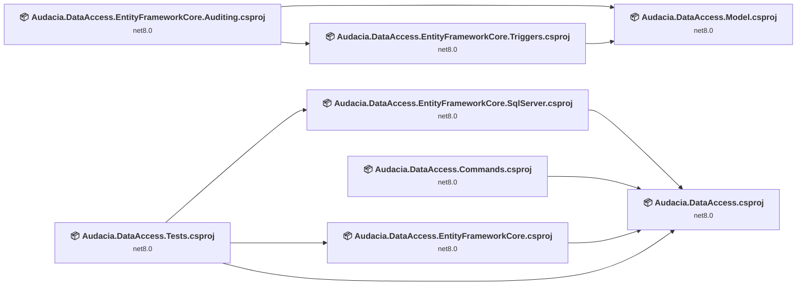
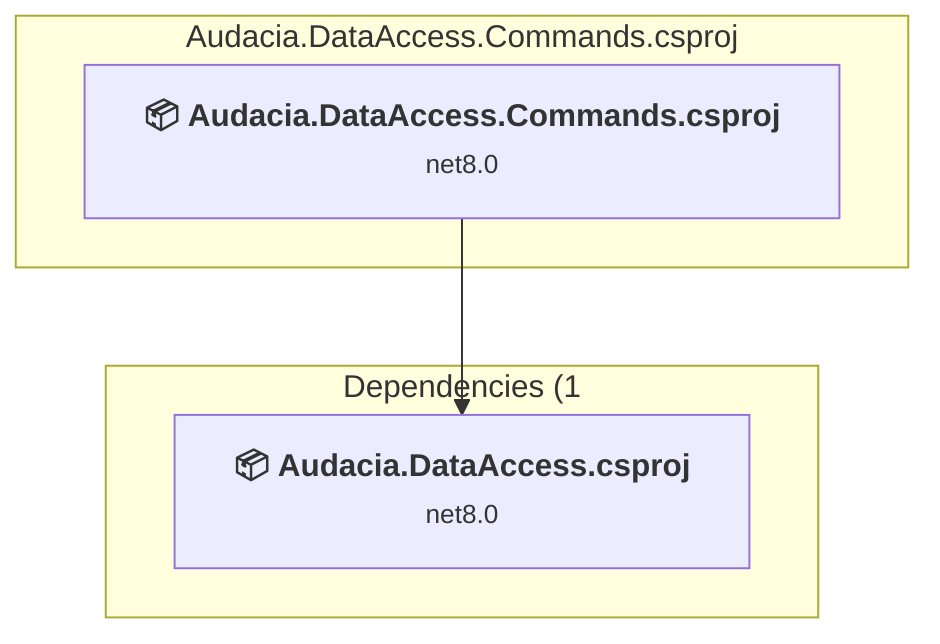
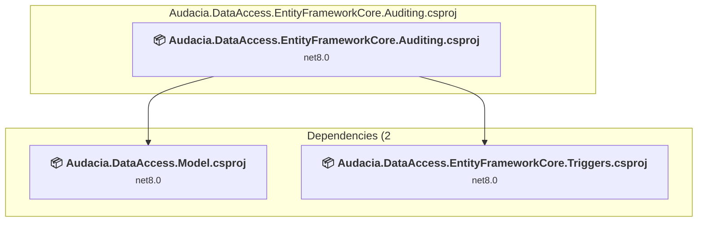
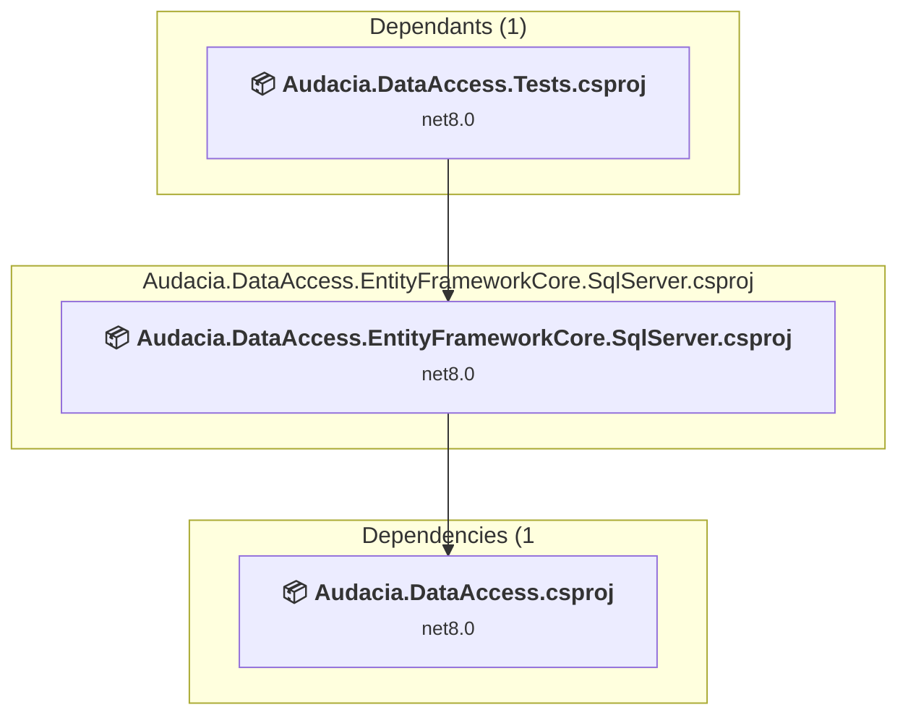
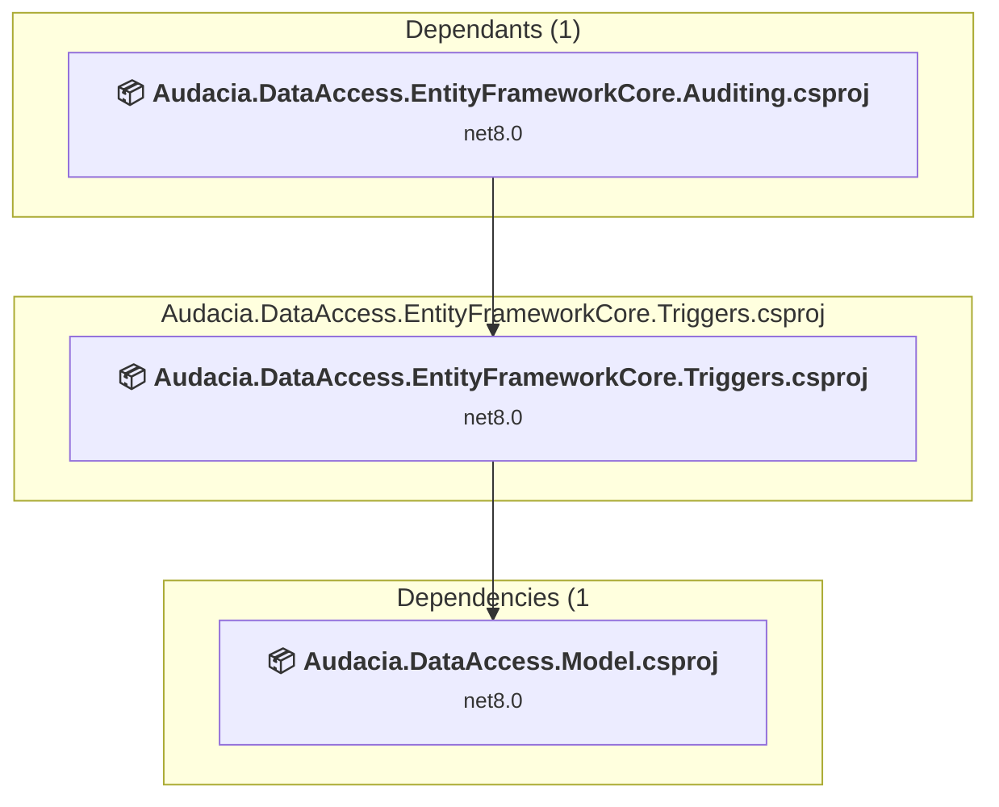
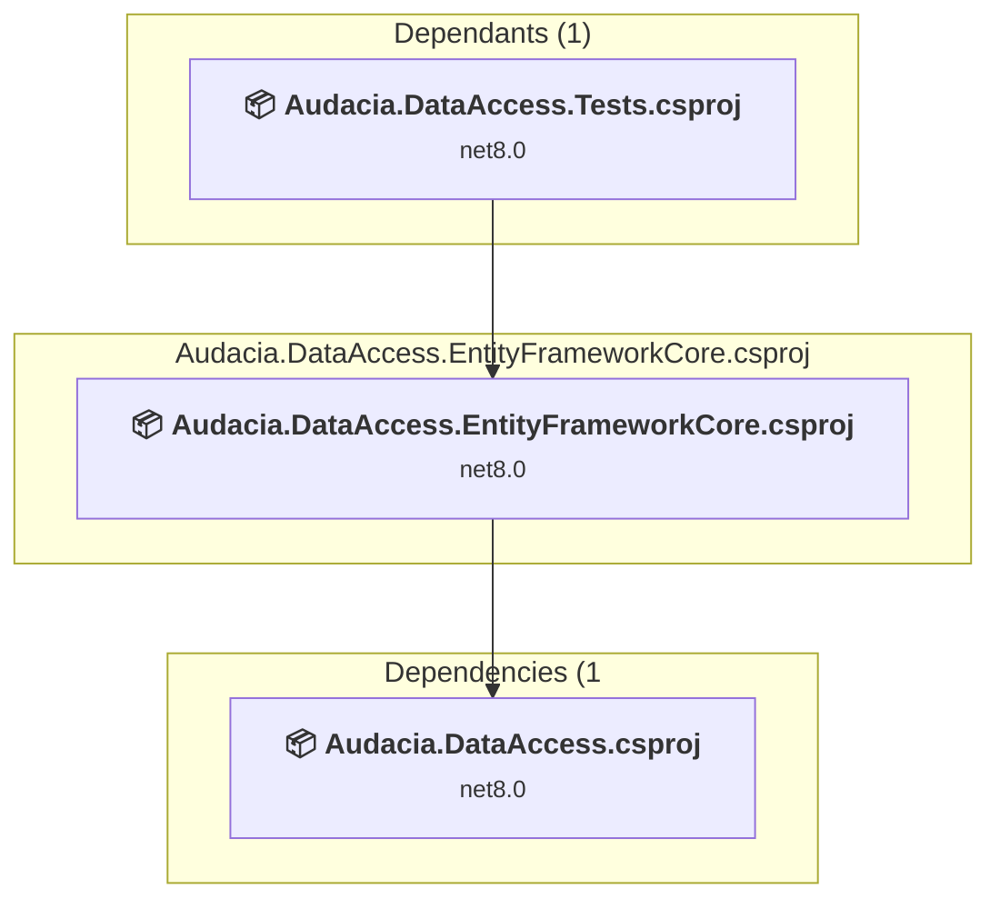
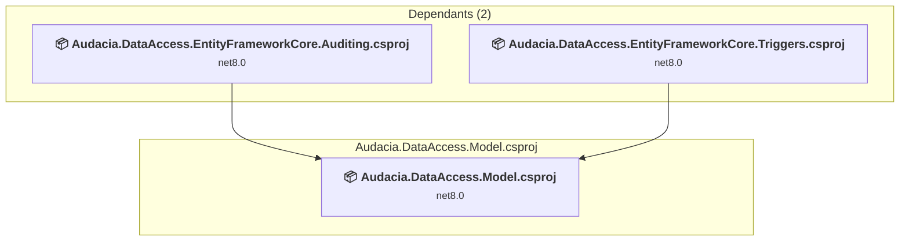
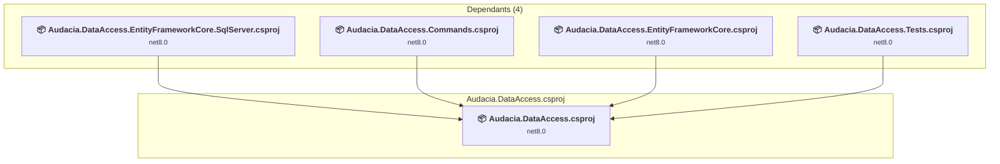
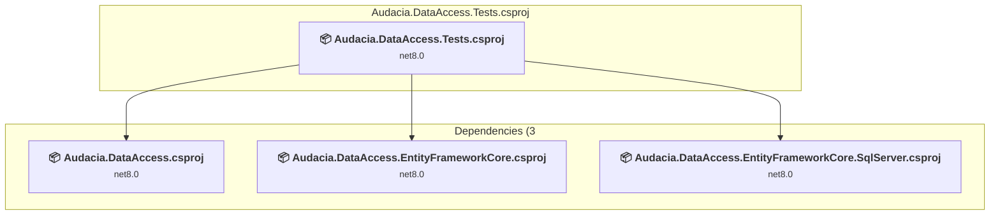

# Projects and dependencies analysis

This document provides a comprehensive overview of the projects and their dependencies in the context of upgrading to .NETCoreApp,Version=v10.0.

## Table of Contents

- [Executive Summary](#executive-Summary)
  - [Highlevel Metrics](#highlevel-metrics)
  - [Projects Compatibility](#projects-compatibility)
  - [Package Compatibility](#package-compatibility)
  - [API Compatibility](#api-compatibility)
- [Aggregate NuGet packages details](#aggregate-nuget-packages-details)
- [Top API Migration Challenges](#top-api-migration-challenges)
  - [Technologies and Features](#technologies-and-features)
  - [Most Frequent API Issues](#most-frequent-api-issues)
- [Projects Relationship Graph](#projects-relationship-graph)
- [Project Details](#project-details)

  - [src\Audacia.DataAccess.Commands\Audacia.DataAccess.Commands.csproj](#srcaudaciadataaccesscommandsaudaciadataaccesscommandscsproj)
  - [src\Audacia.DataAccess.EntityFrameworkCore.Auditing\Audacia.DataAccess.EntityFrameworkCore.Auditing.csproj](#srcaudaciadataaccessentityframeworkcoreauditingaudaciadataaccessentityframeworkcoreauditingcsproj)
  - [src\Audacia.DataAccess.EntityFrameworkCore.SqlServer\Audacia.DataAccess.EntityFrameworkCore.SqlServer.csproj](#srcaudaciadataaccessentityframeworkcoresqlserveraudaciadataaccessentityframeworkcoresqlservercsproj)
  - [src\Audacia.DataAccess.EntityFrameworkCore.Triggers\Audacia.DataAccess.EntityFrameworkCore.Triggers.csproj](#srcaudaciadataaccessentityframeworkcoretriggersaudaciadataaccessentityframeworkcoretriggerscsproj)
  - [src\Audacia.DataAccess.EntityFrameworkCore\Audacia.DataAccess.EntityFrameworkCore.csproj](#srcaudaciadataaccessentityframeworkcoreaudaciadataaccessentityframeworkcorecsproj)
  - [src\Audacia.DataAccess.Model\Audacia.DataAccess.Model.csproj](#srcaudaciadataaccessmodelaudaciadataaccessmodelcsproj)
  - [src\Audacia.DataAccess\Audacia.DataAccess.csproj](#srcaudaciadataaccessaudaciadataaccesscsproj)
  - [tests\Audacia.DataAccess.Tests\Audacia.DataAccess.Tests.csproj](#testsaudaciadataaccesstestsaudaciadataaccesstestscsproj)

## Executive Summary

### Highlevel Metrics

| Metric | Count | Status |
| :--- | :---: | :--- |
| Total Projects | 8 | All require upgrade |
| Total NuGet Packages | 14 | 4 need upgrade |
| Total Code Files | 90 |  |
| Total Code Files with Incidents | 8 |  |
| Total Lines of Code | 6510 |  |
| Total Number of Issues | 20 |  |
| Estimated LOC to modify | 0+ | at least 0.0% of codebase |

### Projects Compatibility

| Project | Target Framework | Difficulty | Package Issues | API Issues | Est. LOC Impact | Description |
| :--- | :---: | :---: | :---: | :---: | :---: | :--- |
| [src\Audacia.DataAccess.Commands\Audacia.DataAccess.Commands.csproj](#srcaudaciadataaccesscommandsaudaciadataaccesscommandscsproj) | net8.0 | 🟢 Low | 0 | 0 |  | ClassLibrary, Sdk Style = True |
| [src\Audacia.DataAccess.EntityFrameworkCore.Auditing\Audacia.DataAccess.EntityFrameworkCore.Auditing.csproj](#srcaudaciadataaccessentityframeworkcoreauditingaudaciadataaccessentityframeworkcoreauditingcsproj) | net8.0 | 🟢 Low | 4 | 0 |  | ClassLibrary, Sdk Style = True |
| [src\Audacia.DataAccess.EntityFrameworkCore.SqlServer\Audacia.DataAccess.EntityFrameworkCore.SqlServer.csproj](#srcaudaciadataaccessentityframeworkcoresqlserveraudaciadataaccessentityframeworkcoresqlservercsproj) | net8.0 | 🟢 Low | 2 | 0 |  | ClassLibrary, Sdk Style = True |
| [src\Audacia.DataAccess.EntityFrameworkCore.Triggers\Audacia.DataAccess.EntityFrameworkCore.Triggers.csproj](#srcaudaciadataaccessentityframeworkcoretriggersaudaciadataaccessentityframeworkcoretriggerscsproj) | net8.0 | 🟢 Low | 3 | 0 |  | ClassLibrary, Sdk Style = True |
| [src\Audacia.DataAccess.EntityFrameworkCore\Audacia.DataAccess.EntityFrameworkCore.csproj](#srcaudaciadataaccessentityframeworkcoreaudaciadataaccessentityframeworkcorecsproj) | net8.0 | 🟢 Low | 1 | 0 |  | ClassLibrary, Sdk Style = True |
| [src\Audacia.DataAccess.Model\Audacia.DataAccess.Model.csproj](#srcaudaciadataaccessmodelaudaciadataaccessmodelcsproj) | net8.0 | 🟢 Low | 0 | 0 |  | ClassLibrary, Sdk Style = True |
| [src\Audacia.DataAccess\Audacia.DataAccess.csproj](#srcaudaciadataaccessaudaciadataaccesscsproj) | net8.0 | 🟢 Low | 0 | 0 |  | ClassLibrary, Sdk Style = True |
| [tests\Audacia.DataAccess.Tests\Audacia.DataAccess.Tests.csproj](#testsaudaciadataaccesstestsaudaciadataaccesstestscsproj) | net8.0 | 🟢 Low | 2 | 0 |  | DotNetCoreApp, Sdk Style = True |

### Package Compatibility

| Status | Count | Percentage |
| :--- | :---: | :---: |
| ✅ Compatible | 10 | 71.4% |
| ⚠️ Incompatible | 0 | 0.0% |
| 🔄 Upgrade Recommended | 4 | 28.6% |
| ***Total NuGet Packages*** | ***14*** | ***100%*** |

### API Compatibility

| Category | Count | Impact |
| :--- | :---: | :--- |
| 🔴 Binary Incompatible | 0 | High - Require code changes |
| 🟡 Source Incompatible | 0 | Medium - Needs re-compilation and potential conflicting API error fixing |
| 🔵 Behavioral change | 0 | Low - Behavioral changes that may require testing at runtime |
| ✅ Compatible | 3555 |  |
| ***Total APIs Analyzed*** | ***3555*** |  |

## Aggregate NuGet packages details

| Package | Current Version | Suggested Version | Projects | Description |
| :--- | :---: | :---: | :--- | :--- |
| Audacia.CodeAnalysis | 1.5.1 |  | [Audacia.DataAccess.Commands.csproj](#srcaudaciadataaccesscommandsaudaciadataaccesscommandscsproj) [Audacia.DataAccess.csproj](#srcaudaciadataaccessaudaciadataaccesscsproj) [Audacia.DataAccess.EntityFrameworkCore.Auditing.csproj](#srcaudaciadataaccessentityframeworkcoreauditingaudaciadataaccessentityframeworkcoreauditingcsproj) [Audacia.DataAccess.EntityFrameworkCore.csproj](#srcaudaciadataaccessentityframeworkcoreaudaciadataaccessentityframeworkcorecsproj) [Audacia.DataAccess.EntityFrameworkCore.SqlServer.csproj](#srcaudaciadataaccessentityframeworkcoresqlserveraudaciadataaccessentityframeworkcoresqlservercsproj) [Audacia.DataAccess.EntityFrameworkCore.Triggers.csproj](#srcaudaciadataaccessentityframeworkcoretriggersaudaciadataaccessentityframeworkcoretriggerscsproj) [Audacia.DataAccess.Model.csproj](#srcaudaciadataaccessmodelaudaciadataaccessmodelcsproj) [Audacia.DataAccess.Tests.csproj](#testsaudaciadataaccesstestsaudaciadataaccesstestscsproj) | ✅Compatible |
| Audacia.CodeAnalysis.Analyzers.Helpers | 1.1.2 |  | [Audacia.DataAccess.EntityFrameworkCore.Triggers.csproj](#srcaudaciadataaccessentityframeworkcoretriggersaudaciadataaccessentityframeworkcoretriggerscsproj) | ✅Compatible |
| Audacia.Commands | 1.1.1 |  | [Audacia.DataAccess.Commands.csproj](#srcaudaciadataaccesscommandsaudaciadataaccesscommandscsproj) | ✅Compatible |
| Audacia.Core | 1.1.2 |  | [Audacia.DataAccess.Commands.csproj](#srcaudaciadataaccesscommandsaudaciadataaccesscommandscsproj) [Audacia.DataAccess.csproj](#srcaudaciadataaccessaudaciadataaccesscsproj) [Audacia.DataAccess.EntityFrameworkCore.Auditing.csproj](#srcaudaciadataaccessentityframeworkcoreauditingaudaciadataaccessentityframeworkcoreauditingcsproj) [Audacia.DataAccess.EntityFrameworkCore.csproj](#srcaudaciadataaccessentityframeworkcoreaudaciadataaccessentityframeworkcorecsproj) [Audacia.DataAccess.EntityFrameworkCore.SqlServer.csproj](#srcaudaciadataaccessentityframeworkcoresqlserveraudaciadataaccessentityframeworkcoresqlservercsproj) [Audacia.DataAccess.EntityFrameworkCore.Triggers.csproj](#srcaudaciadataaccessentityframeworkcoretriggersaudaciadataaccessentityframeworkcoretriggerscsproj) | ✅Compatible |
| FluentAssertions | 6.12.2 |  | [Audacia.DataAccess.Tests.csproj](#testsaudaciadataaccesstestsaudaciadataaccesstestscsproj) | ✅Compatible |
| Microsoft.EntityFrameworkCore | 8.0.11 | 10.0.5 | [Audacia.DataAccess.EntityFrameworkCore.Auditing.csproj](#srcaudaciadataaccessentityframeworkcoreauditingaudaciadataaccessentityframeworkcoreauditingcsproj) [Audacia.DataAccess.EntityFrameworkCore.csproj](#srcaudaciadataaccessentityframeworkcoreaudaciadataaccessentityframeworkcorecsproj) [Audacia.DataAccess.EntityFrameworkCore.SqlServer.csproj](#srcaudaciadataaccessentityframeworkcoresqlserveraudaciadataaccessentityframeworkcoresqlservercsproj) [Audacia.DataAccess.EntityFrameworkCore.Triggers.csproj](#srcaudaciadataaccessentityframeworkcoretriggersaudaciadataaccessentityframeworkcoretriggerscsproj) [Audacia.DataAccess.Tests.csproj](#testsaudaciadataaccesstestsaudaciadataaccesstestscsproj) | NuGet package upgrade is recommended |
| Microsoft.EntityFrameworkCore.InMemory | 8.0.11 | 10.0.5 | [Audacia.DataAccess.Tests.csproj](#testsaudaciadataaccesstestsaudaciadataaccesstestscsproj) | NuGet package upgrade is recommended |
| Microsoft.EntityFrameworkCore.Relational | 8.0.11 | 10.0.5 | [Audacia.DataAccess.EntityFrameworkCore.Auditing.csproj](#srcaudaciadataaccessentityframeworkcoreauditingaudaciadataaccessentityframeworkcoreauditingcsproj) | NuGet package upgrade is recommended |
| Microsoft.EntityFrameworkCore.SqlServer | 8.0.11 | 10.0.5 | [Audacia.DataAccess.EntityFrameworkCore.SqlServer.csproj](#srcaudaciadataaccessentityframeworkcoresqlserveraudaciadataaccessentityframeworkcoresqlservercsproj) | NuGet package upgrade is recommended |
| Microsoft.NET.Test.Sdk | 17.11.1 |  | [Audacia.DataAccess.Tests.csproj](#testsaudaciadataaccesstestsaudaciadataaccesstestscsproj) | ✅Compatible |
| System.Net.Http | 4.3.4 |  | [Audacia.DataAccess.EntityFrameworkCore.Auditing.csproj](#srcaudaciadataaccessentityframeworkcoreauditingaudaciadataaccessentityframeworkcoreauditingcsproj) [Audacia.DataAccess.EntityFrameworkCore.Triggers.csproj](#srcaudaciadataaccessentityframeworkcoretriggersaudaciadataaccessentityframeworkcoretriggerscsproj) | NuGet package functionality is included with framework reference |
| System.Text.RegularExpressions | 4.3.1 |  | [Audacia.DataAccess.EntityFrameworkCore.Auditing.csproj](#srcaudaciadataaccessentityframeworkcoreauditingaudaciadataaccessentityframeworkcoreauditingcsproj) [Audacia.DataAccess.EntityFrameworkCore.Triggers.csproj](#srcaudaciadataaccessentityframeworkcoretriggersaudaciadataaccessentityframeworkcoretriggerscsproj) | NuGet package functionality is included with framework reference |
| xunit | 2.9.2 |  | [Audacia.DataAccess.Tests.csproj](#testsaudaciadataaccesstestsaudaciadataaccesstestscsproj) | ✅Compatible |
| xunit.runner.visualstudio | 2.8.2 |  | [Audacia.DataAccess.Tests.csproj](#testsaudaciadataaccesstestsaudaciadataaccesstestscsproj) | ✅Compatible |

## Top API Migration Challenges

### Technologies and Features

| Technology | Issues | Percentage | Migration Path |
| :--- | :---: | :---: | :--- |

### Most Frequent API Issues

| API | Count | Percentage | Category |
| :--- | :---: | :---: | :--- |

## Projects Relationship Graph

Legend:
📦 SDK-style project
⚙️ Classic project

## Project Details

### src\Audacia.DataAccess.Commands\Audacia.DataAccess.Commands.csproj

#### Project Info

- **Current Target Framework:** net8.0
- **Proposed Target Framework:** net10.0
- **SDK-style**: True
- **Project Kind:** ClassLibrary
- **Dependencies**: 1
- **Dependants**: 0
- **Number of Files**: 1
- **Number of Files with Incidents**: 1
- **Lines of Code**: 82
- **Estimated LOC to modify**: 0+ (at least 0.0% of the project)

#### Dependency Graph

Legend:
📦 SDK-style project
⚙️ Classic project

### API Compatibility

| Category | Count | Impact |
| :--- | :---: | :--- |
| 🔴 Binary Incompatible | 0 | High - Require code changes |
| 🟡 Source Incompatible | 0 | Medium - Needs re-compilation and potential conflicting API error fixing |
| 🔵 Behavioral change | 0 | Low - Behavioral changes that may require testing at runtime |
| ✅ Compatible | 46 |  |
| ***Total APIs Analyzed*** | ***46*** |  |

### src\Audacia.DataAccess.EntityFrameworkCore.Auditing\Audacia.DataAccess.EntityFrameworkCore.Auditing.csproj

#### Project Info

- **Current Target Framework:** net8.0
- **Proposed Target Framework:** net10.0
- **SDK-style**: True
- **Project Kind:** ClassLibrary
- **Dependencies**: 2
- **Dependants**: 0
- **Number of Files**: 19
- **Number of Files with Incidents**: 1
- **Lines of Code**: 1598
- **Estimated LOC to modify**: 0+ (at least 0.0% of the project)

#### Dependency Graph

Legend:
📦 SDK-style project
⚙️ Classic project

### API Compatibility

| Category | Count | Impact |
| :--- | :---: | :--- |
| 🔴 Binary Incompatible | 0 | High - Require code changes |
| 🟡 Source Incompatible | 0 | Medium - Needs re-compilation and potential conflicting API error fixing |
| 🔵 Behavioral change | 0 | Low - Behavioral changes that may require testing at runtime |
| ✅ Compatible | 896 |  |
| ***Total APIs Analyzed*** | ***896*** |  |

### src\Audacia.DataAccess.EntityFrameworkCore.SqlServer\Audacia.DataAccess.EntityFrameworkCore.SqlServer.csproj

#### Project Info

- **Current Target Framework:** net8.0
- **Proposed Target Framework:** net10.0
- **SDK-style**: True
- **Project Kind:** ClassLibrary
- **Dependencies**: 1
- **Dependants**: 1
- **Number of Files**: 2
- **Number of Files with Incidents**: 1
- **Lines of Code**: 687
- **Estimated LOC to modify**: 0+ (at least 0.0% of the project)

#### Dependency Graph

Legend:
📦 SDK-style project
⚙️ Classic project

### API Compatibility

| Category | Count | Impact |
| :--- | :---: | :--- |
| 🔴 Binary Incompatible | 0 | High - Require code changes |
| 🟡 Source Incompatible | 0 | Medium - Needs re-compilation and potential conflicting API error fixing |
| 🔵 Behavioral change | 0 | Low - Behavioral changes that may require testing at runtime |
| ✅ Compatible | 422 |  |
| ***Total APIs Analyzed*** | ***422*** |  |

### src\Audacia.DataAccess.EntityFrameworkCore.Triggers\Audacia.DataAccess.EntityFrameworkCore.Triggers.csproj

#### Project Info

- **Current Target Framework:** net8.0
- **Proposed Target Framework:** net10.0
- **SDK-style**: True
- **Project Kind:** ClassLibrary
- **Dependencies**: 1
- **Dependants**: 1
- **Number of Files**: 8
- **Number of Files with Incidents**: 1
- **Lines of Code**: 788
- **Estimated LOC to modify**: 0+ (at least 0.0% of the project)

#### Dependency Graph

Legend:
📦 SDK-style project
⚙️ Classic project

### API Compatibility

| Category | Count | Impact |
| :--- | :---: | :--- |
| 🔴 Binary Incompatible | 0 | High - Require code changes |
| 🟡 Source Incompatible | 0 | Medium - Needs re-compilation and potential conflicting API error fixing |
| 🔵 Behavioral change | 0 | Low - Behavioral changes that may require testing at runtime |
| ✅ Compatible | 406 |  |
| ***Total APIs Analyzed*** | ***406*** |  |

### src\Audacia.DataAccess.EntityFrameworkCore\Audacia.DataAccess.EntityFrameworkCore.csproj

#### Project Info

- **Current Target Framework:** net8.0
- **Proposed Target Framework:** net10.0
- **SDK-style**: True
- **Project Kind:** ClassLibrary
- **Dependencies**: 1
- **Dependants**: 1
- **Number of Files**: 5
- **Number of Files with Incidents**: 1
- **Lines of Code**: 307
- **Estimated LOC to modify**: 0+ (at least 0.0% of the project)

#### Dependency Graph

Legend:
📦 SDK-style project
⚙️ Classic project

### API Compatibility

| Category | Count | Impact |
| :--- | :---: | :--- |
| 🔴 Binary Incompatible | 0 | High - Require code changes |
| 🟡 Source Incompatible | 0 | Medium - Needs re-compilation and potential conflicting API error fixing |
| 🔵 Behavioral change | 0 | Low - Behavioral changes that may require testing at runtime |
| ✅ Compatible | 200 |  |
| ***Total APIs Analyzed*** | ***200*** |  |

### src\Audacia.DataAccess.Model\Audacia.DataAccess.Model.csproj

#### Project Info

- **Current Target Framework:** net8.0
- **Proposed Target Framework:** net10.0
- **SDK-style**: True
- **Project Kind:** ClassLibrary
- **Dependencies**: 0
- **Dependants**: 2
- **Number of Files**: 5
- **Number of Files with Incidents**: 1
- **Lines of Code**: 99
- **Estimated LOC to modify**: 0+ (at least 0.0% of the project)

#### Dependency Graph

Legend:
📦 SDK-style project
⚙️ Classic project

### API Compatibility

| Category | Count | Impact |
| :--- | :---: | :--- |
| 🔴 Binary Incompatible | 0 | High - Require code changes |
| 🟡 Source Incompatible | 0 | Medium - Needs re-compilation and potential conflicting API error fixing |
| 🔵 Behavioral change | 0 | Low - Behavioral changes that may require testing at runtime |
| ✅ Compatible | 28 |  |
| ***Total APIs Analyzed*** | ***28*** |  |

### src\Audacia.DataAccess\Audacia.DataAccess.csproj

#### Project Info

- **Current Target Framework:** net8.0
- **Proposed Target Framework:** net10.0
- **SDK-style**: True
- **Project Kind:** ClassLibrary
- **Dependencies**: 0
- **Dependants**: 4
- **Number of Files**: 41
- **Number of Files with Incidents**: 1
- **Lines of Code**: 2454
- **Estimated LOC to modify**: 0+ (at least 0.0% of the project)

#### Dependency Graph

Legend:
📦 SDK-style project
⚙️ Classic project

### API Compatibility

| Category | Count | Impact |
| :--- | :---: | :--- |
| 🔴 Binary Incompatible | 0 | High - Require code changes |
| 🟡 Source Incompatible | 0 | Medium - Needs re-compilation and potential conflicting API error fixing |
| 🔵 Behavioral change | 0 | Low - Behavioral changes that may require testing at runtime |
| ✅ Compatible | 908 |  |
| ***Total APIs Analyzed*** | ***908*** |  |

### tests\Audacia.DataAccess.Tests\Audacia.DataAccess.Tests.csproj

#### Project Info

- **Current Target Framework:** net8.0
- **Proposed Target Framework:** net10.0
- **SDK-style**: True
- **Project Kind:** DotNetCoreApp
- **Dependencies**: 3
- **Dependants**: 0
- **Number of Files**: 11
- **Number of Files with Incidents**: 1
- **Lines of Code**: 495
- **Estimated LOC to modify**: 0+ (at least 0.0% of the project)

#### Dependency Graph

Legend:
📦 SDK-style project
⚙️ Classic project

### API Compatibility

| Category | Count | Impact |
| :--- | :---: | :--- |
| 🔴 Binary Incompatible | 0 | High - Require code changes |
| 🟡 Source Incompatible | 0 | Medium - Needs re-compilation and potential conflicting API error fixing |
| 🔵 Behavioral change | 0 | Low - Behavioral changes that may require testing at runtime |
| ✅ Compatible | 649 |  |
| ***Total APIs Analyzed*** | ***649*** |  |

